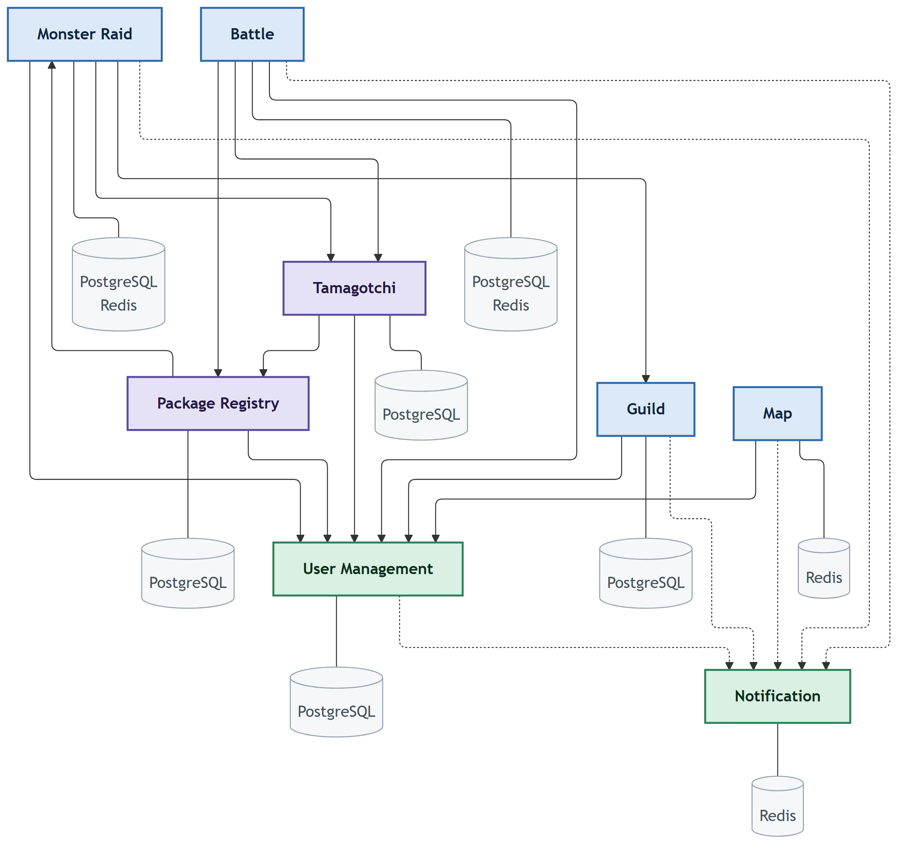

# pad-team-14-tamagotchi-go

Common Public Repository (CPR) for Team 14 — **Topic 2: Tamagotchi Go** (FAF.PAD21.1, Autumn 2026).

A distributed system of 8 microservices letting players raise, battle, and trade virtual pets ("Tamagotchis") across independently developed client apps ("packages") sharing one backend.


## Service Boundaries

### User Management Service
Owns the global identity of players: registration, authentication, profiles, friends/enemies, and both currencies (package-local currency and the shared global currency). Authoritative for identity/relationship/currency questions asked by every other service (e.g. "does this user have enough global currency?").

### Battle Service
Owns turn-based PvP combat execution once a match is created. Calculates damage from Tamagotchi level, type advantage, equipped boosts, and current health; tracks battle state/turn. Distributes rewards (global currency, XP, loser's primary Tamagotchi) at battle end. Does **not** own Tamagotchi or user records — only consults them.

### Tamagotchi Service
Owns the globally relevant state of every Tamagotchi: identity, owner, combat type (one of 6 elemental types with an advantage cycle), level, sprite reference, and package-local health stats (hunger, tiredness, happiness, etc. — intentionally *not* normalized across packages). Secondary Tamagotchis are references to existing entries, never new rows.

### Notification Service
Owns asynchronous delivery to clients via Firebase push notifications. Consumes events published by other services (friend request, nearby player, battle request, guild invite, raid started, etc.) and decides how/whether to deliver them. Does not generate the underlying events itself.

### Map Service
Owns each user's latest known geolocation and proximity detection. Shows nearby users on a map (friends/enemies always visible; unknown users become visible within ~6m). Emits proximity events that *suggest* befriending/battling. Does **not** manage battles or notifications directly — only signals opportunities for them.

### Monster Raid Service
Owns cooperative clicker-style guild raids against a shared monster: current HP, participating users, damage dealt, timestamps, raid status/duration. Distributes rewards on kill or handles raid failure on timeout. Consults Tamagotchi combat stats but doesn't own them.

### Guild Service
Owns guild identity, membership, roles (owner/officer/member), and real-time guild chat over WebSockets. Provides the social context for Monster Raids — members join an active raid with their primary Tamagotchi. Uses User Management Service to resolve identity/relationships for invitations.

### Package Registry Service
Owns the registry of client apps ("packages") participating in the ecosystem: package identifier/version/status, associated moderators/admins, and which users belong to which package. Stores each package's local Tamagotchi stat definitions/thresholds (non-normalized) so Battle Service can compute package-specific bonuses without a shared schema. Admins here design/schedule Monster Raids.

## Technologies & Communication Patterns

The team works in **2 languages**, split by repo/member pair:

| Repo | Service | Language / Framework | Sync communication | Async communication |
|---|---|---|---|---|
| `user-management-service` | User Management | **Go** (e.g. Gin/Echo) | REST CRUD (auth, profile, currency checks) | Publishes friend/relationship/currency-change events for other services to consume |
| `battle-service` | Battle | **Go** (e.g. Gin/Echo) | REST to create/query a match; WebSocket pushes live turn/state updates during a match | Publishes battle-end events (reward/XP/currency change, Tamagotchi transfer) for Notification/Tamagotchi/User Management to consume |
| `tamagotchi-service` | Tamagotchi | **Go** (e.g. Gin/Echo) | REST CRUD (create/level/read stats) | Publishes Tamagotchi-updated/transferred events |
| `notification-service` | Notification | **Go** (e.g. Gin/Echo) | REST for device registration only | Purely event-driven: consumes events from every other service and delivers via Firebase push; no service should call it synchronously for delivery |
| `map-service` | Map | **TypeScript** (Node.js, e.g. NestJS/Express) | REST for nearby-user queries; WebSocket/streaming for continuous geolocation updates | Emits proximity events (async, fire-and-forget) rather than blocking callers |
| `monster-raid-service` | Monster Raid | **TypeScript** (Node.js, e.g. NestJS/Express) | REST for raid queries/attacks (current HP/status) | Publishes raid-complete/raid-failed events for rewards |
| `guild-service` | Guild | **TypeScript** (Node.js, e.g. NestJS/Express) | REST for guild/membership CRUD; WebSocket for Guild Chat (real-time, low-latency) | Publishes invite/raid-join events |
| `package-registry-service` | Package Registry | **TypeScript** (Node.js, e.g. NestJS/Express) | REST for package/moderator/stat-definition CRUD | Publishes raid-config-activated events for Monster Raid Service |

**Why this split:**
- **Go** for User Management, Battle, Tamagotchi, Notification: these are the services with the most structured, relational domain data (accounts, currencies, combat math, stat definitions), and Go's low memory footprint, fast startup, and static typing keep these always-on core services cheap to run while still giving strong compile-time guarantees around combat/currency logic where correctness matters most (e.g. atomic Tamagotchi transfer on battle end). Its built-in goroutine concurrency also handles the event consuming/publishing these services do without extra machinery.
- **TypeScript (Node.js)** for Map, Monster Raid, Guild, Package Registry: these are I/O-heavy, connection-heavy services (constant geolocation streams, guild chat WebSockets, many concurrent raid clicks) where Node's non-blocking event loop and first-class WebSocket support are a natural fit, and where the JSON-shaped, loosely-structured config data (package-specific stat definitions, raid configs) suits a more dynamic language.
- **WebSockets** are used specifically where the interaction is inherently real-time/bidirectional (Battle turn updates, Guild Chat, Monster Raid live damage) — REST elsewhere, since most other operations are simple request/response.
- **Async events** (rather than synchronous calls) are used wherever a service shouldn't block on/depend on the availability of a downstream consumer — most notably Notification Service, and reward/XP distribution after Battle or Monster Raid completes.

## Communication Contract

### Data management strategy

**Database-per-service.** Each of the 8 services owns its own database, matching the ownership boundaries above — no service reaches into another's schema directly. Cross-service data needs are resolved through synchronous REST/WebSocket calls or async events, never shared tables.

| Service | Suggested store | Why |
|---|---|---|
| User Management | PostgreSQL | Relational: accounts, currencies, friend/enemy graph, needs transactional integrity |
| Battle | PostgreSQL (+ in-memory/Redis for live match state) | Match history is relational; active turn state is ephemeral/high-churn |
| Tamagotchi | PostgreSQL | Relational ownership records; package-local stat blobs stored as JSON columns (non-normalized by design) |
| Notification | Redis / lightweight queue store | Ephemeral delivery queue, not long-term source of truth |
| Map | Redis (geospatial) | Frequently-updated key-value/geo lookups, not relational history |
| Monster Raid | PostgreSQL (+ Redis for live HP/damage counters) | Raid definition/results are relational; live damage ticking is high-frequency |
| Guild | PostgreSQL | Relational membership/roles; chat messages can go in the same store or a append-only log |
| Package Registry | PostgreSQL | Relational config data (packages, moderators, stat-definition schemas as JSON) |

All cross-service reads (e.g. Battle Service checking a user's currency) go through that owning service's REST API — never direct DB access.

### Endpoints

Each field below is annotated with its type (`string`, `int`, `float`, `bool`, `object`, `array<T>`, ISO 8601 timestamp, etc.).

#### User Management Service (`user-battle`, Go)

**Register a Player**

`POST` `/users/register` — Description: Creates a new player account. Payload:

```json
{
  "username": "string",
  "password": "string",
  "email": "string",
  "packageId": "string"
}
```

Success Response (201 Created):

```json
{
  "userId": "string",
  "username": "string",
  "email": "string"
}
```

**Login**

`POST` `/users/login` — Description: Authenticates a player and returns a JWT. Payload:

```json
{
  "username": "string",
  "password": "string"
}
```

Success Response (200 OK):

```json
{
  "token": "string",
  "userId": "string"
}
```

**Get Player**

`GET` `/users/{userId}` — Description: Retrieves a player's profile.

Success Response (200 OK):

```json
{
  "userId": "string",
  "username": "string",
  "profile": "string",
  "level": "int",
  "xp": "int"
}
```

**Get Currency Balance**

`GET` `/users/{userId}/currency` — Description: Retrieves a player's local and global currency balances.

Success Response (200 OK):

```json
{
  "localCurrency": "int",
  "globalCurrency": "int"
}
```

**Adjust Currency**

`POST` `/users/{userId}/currency/adjust` — Description: Applies a currency delta (positive or negative) to a player. `idempotencyKey` is required for adjustments originating from async events (`BattleEnded`, `RaidCompleted`) — those events may be redelivered at least once, and a repeated key must no-op rather than reapplying the delta, or a redelivered reward event double-pays a player. Payload:

```json
{
  "globalCurrencyDelta": "int",
  "localCurrencyDelta": "int",
  "reason": "string",
  "idempotencyKey": "string"
}
```

Success Response (200 OK):

```json
{
  "localCurrency": "int",
  "globalCurrency": "int"
}
```

**Send Friend Request**

`POST` `/users/{userId}/friends/{targetId}` — Description: Sends or accepts a friend request between two players.

Success Response (200 OK):

```json
{
  "status": "string (enum: pending, friends)"
}
```

**List Friends**

`GET` `/users/{userId}/friends` — Description: Lists a player's friends.

Success Response (200 OK):

```json
[
  {
    "userId": "string",
    "username": "string",
    "status": "string"
  }
]
```

**Get Relationship**

`GET` `/users/{userId}/relationship/{targetId}` — Description: Returns the relationship between two players.

Success Response (200 OK):

```json
{
  "relationship": "string (enum: friend, enemy, none)"
}
```

**Remove Relationship**

`DELETE` `/users/{userId}/friends/{targetId}` — Description: Cancels a pending friend request, or ends an existing friendship. Previously the only friend-related mutation was additive (pending → friends); this closes the gap where a request could never be rejected or reversed.

Success Response (200 OK):

```json
{
  "relationship": "string (enum: none)"
}
```

**Mark as Enemy**

`POST` `/users/{userId}/enemies/{targetId}` — Description: Marks another player as an enemy (e.g. after a proximity-suggested battle, or a manual block). Required so that Map Service's "friends/enemies always visible" rule has an `enemy` state to actually visualize — previously only `friend` had a write path.

Success Response (200 OK):

```json
{
  "relationship": "string (enum: enemy)"
}
```

#### Battle Service (`user-battle`, Go)

**Challenge a Player**

`POST` `/battles/challenge` — Description: Challenges another player to a PvP battle, submitting the challenger's own team. Previously `POST /battles` only had room for one shared team selection even though each player picks their own primary/secondary Tamagotchi and boosts — this two-step challenge/accept flow gives both sides a place to submit their team. `boosts` references Tamagotchi Service's per-Tamagotchi `equippedBoosts` (see the Tamagotchi Service section) — Battle Service resolves them by ID, it doesn't own boost data itself. Payload:

```json
{
  "challengerId": "string",
  "targetId": "string",
  "primaryTamagotchiId": "string",
  "secondaryTamagotchiId": "string",
  "boosts": "array<string>"
}
```

Success Response (201 Created):

```json
{
  "battleId": "string",
  "status": "string (enum: pending_acceptance)"
}
```

**Accept a Challenge**

`POST` `/battles/{battleId}/accept` — Description: Submits the challenged player's own team, finalizing both sides and starting the battle. Payload:

```json
{
  "primaryTamagotchiId": "string",
  "secondaryTamagotchiId": "string",
  "boosts": "array<string>"
}
```

Success Response (200 OK):

```json
{
  "battleId": "string",
  "status": "string (enum: in_progress)"
}
```

**Get Battle**

`GET` `/battles/{battleId}` — Description: Retrieves the current state of a battle.

Success Response (200 OK):

```json
{
  "battleId": "string",
  "state": "string",
  "currentTurn": "int",
  "healthP1": "int",
  "healthP2": "int"
}
```

> **Type advantage & package bonuses:** damage calculation resolves type advantage via Tamagotchi Service's `GET /types/advantages` (canonical source, see the Tamagotchi Service section — Battle Service must not hardcode its own copy of the advantage cycle) and package-specific stat bonuses via Package Registry's stat definitions. If a Tamagotchi has a stat with no matching definition in Package Registry (e.g. an incompletely-configured package), that stat contributes **zero bonus** rather than failing the battle.

**Submit Battle Action**

`POST` `/battles/{battleId}/action` — Description: Submits a turn action for a battle. Payload:

```json
{
  "userId": "string",
  "action": "string",
  "targetMoveId": "string"
}
```

Success Response (200 OK):

```json
{
  "battleId": "string",
  "state": "string",
  "log": "array<string>"
}
```

**Live Battle Updates**

`WS` `/battles/{battleId}/live` — Description: Server pushes live turn/state updates for a battle.

Server push message:

```json
{
  "type": "string (enum: turn_update, battle_end)",
  "payload": "object"
}
```

**Battle Ended (internal event)**

Not client-facing — published when a battle ends, consumed by Notification/Tamagotchi/User Management services. Each consumer must treat this idempotently keyed by `battleId` (e.g. via the `idempotencyKey` on Tamagotchi/User Management writes it triggers) — at-least-once delivery means a consumer can see the same `BattleEnded` event more than once, and reapplying it would double-grant rewards or double-transfer ownership.

```json
{
  "battleId": "string",
  "winnerId": "string",
  "loserId": "string",
  "rewardCurrency": "int",
  "rewardXp": "int",
  "transferredTamagotchiId": "string"
}
```

#### Tamagotchi Service (`tamagotchi-notification`, Go)

**Get Type Advantages**

`GET` `/types/advantages` — Description: Returns the canonical six-type elemental advantage cycle. This service owns the definition since it already owns the `type` field on every Tamagotchi — Battle Service consults this endpoint rather than keeping its own independently-maintained copy, so the two can't drift.

Success Response (200 OK):

```json
{
  "cycle": "array<string> (e.g. [\"Flame\", \"Nature\", \"Earth\", \"Electric\", \"Water\", \"Shadow\"])"
}
```

> Interpretation: each type is strong against the next one in the cycle (wrapping around), e.g. Flame → Nature.

**Create Tamagotchi**

`POST` `/tamagotchis` — Description: Creates a new Tamagotchi for a player. Payload:

```json
{
  "ownerId": "string",
  "type": "string",
  "packageId": "string",
  "name": "string"
}
```

Success Response (201 Created):

```json
{
  "tamagotchiId": "string",
  "type": "string",
  "level": "int",
  "stats": "object"
}
```

**Get Tamagotchi**

`GET` `/tamagotchis/{id}` — Description: Retrieves a Tamagotchi's details.

Success Response (200 OK):

```json
{
  "tamagotchiId": "string",
  "ownerId": "string",
  "type": "string",
  "level": "int",
  "sprite": "string",
  "packageStats": "object"
}
```

**List Player's Tamagotchis**

`GET` `/users/{userId}/tamagotchis` — Description: Lists all Tamagotchis owned by a player.

Success Response (200 OK):

```json
[
  {
    "tamagotchiId": "string",
    "type": "string",
    "level": "int",
    "isPrimary": "bool",
    "equippedBoosts": "array<string>"
  }
]
```

**Set Primary Tamagotchi**

`PATCH` `/users/{userId}/tamagotchis/{id}/set-primary` — Description: Designates a Tamagotchi as the player's primary. Previously `isPrimary` was returned everywhere but never had a write path — a newly-created package starter Tamagotchi defaults to primary at creation time; a Tamagotchi acquired via `transfer-owner` (e.g. won in battle) defaults to **secondary** for its new owner unless this endpoint promotes it. Setting a new primary demotes the previous one to secondary (a player always has exactly one primary).

Success Response (200 OK):

```json
{
  "tamagotchiId": "string",
  "isPrimary": "bool"
}
```

**Update Tamagotchi Stats**

`PATCH` `/tamagotchis/{id}/stats` — Description: Updates a Tamagotchi's package-local stats. `statUpdates` keys must match a `stat_key` already defined for this Tamagotchi's package in Package Registry Service's stat definitions (`PUT /packages/{packageId}/stat-definitions`) — an update for an undefined key should be rejected rather than silently stored, since Battle Service's bonus calculation depends on every stored stat resolving to a known definition. Payload:

```json
{
  "statUpdates": "object"
}
```

Success Response (200 OK):

```json
{
  "tamagotchiId": "string",
  "packageStats": "object"
}
```

**Add XP**

`POST` `/tamagotchis/{id}/xp` — Description: Adds experience points to a Tamagotchi, possibly leveling it up. Payload:

```json
{
  "xpAmount": "int"
}
```

Success Response (200 OK):

```json
{
  "tamagotchiId": "string",
  "level": "int",
  "xp": "int"
}
```

**Transfer Ownership**

`POST` `/tamagotchis/{id}/transfer-owner` — Description: Transfers a Tamagotchi to a new owner (e.g. on battle loss). This mutates the existing record's `ownerId` in place — per spec, a Tamagotchi acquired this way is a **reference to the existing entry, never a new row**. The transferred Tamagotchi defaults to `isPrimary: false` for its new owner (use `set-primary` above to promote it). Payload:

```json
{
  "newOwnerId": "string"
}
```

Success Response (200 OK):

```json
{
  "tamagotchiId": "string",
  "ownerId": "string"
}
```

#### Notification Service (`tamagotchi-notification`, Go)

**Register Device**

`POST` `/notifications/register-device` — Description: Registers a device's Firebase token for push notifications. Payload:

```json
{
  "userId": "string",
  "fcmToken": "string"
}
```

Success Response (200 OK):

```json
{
  "status": "string (enum: registered)"
}
```

**List Notifications**

`GET` `/notifications/{userId}` — Description: Lists a player's notifications. Retained for **30 days**, then evicted — matches the Redis-backed store choice (an ephemeral delivery queue, not a durable long-term history) rather than promising unbounded retention.

Success Response (200 OK):

```json
[
  {
    "id": "string",
    "type": "string",
    "payload": "object",
    "read": "bool",
    "createdAt": "string (ISO 8601 timestamp)"
  }
]
```

**Mark Notification as Read**

`PATCH` `/notifications/{id}/read` — Description: Marks a single notification as read. Previously `read` was returned in every response but had no write path.

Success Response (200 OK):

```json
{
  "id": "string",
  "read": "bool"
}
```

> No public "send" endpoint — notifications are triggered internally by consuming events: `FriendRequestReceived` (User Management), `ProximityDetected` (Map Service — corrected here from `NearbyPlayerDetected`, which didn't match what Map Service actually publishes), `BattleRequestReceived`/`BattleEnded` (Battle Service), `TamagotchiCaptured` (Battle Service, part of `BattleEnded`), `GuildInvitation` (Guild Service), `RaidStarted`/`RaidCompleted`/`RaidFailed` (Monster Raid Service). Every publisher's event payload shape is defined once, in that publishing service's own section — this service should not redefine or assume a shape independently, since duplicated definitions are exactly what drifts. Publishers deliver at-least-once; this service should dedupe by an event id rather than assume exactly-once delivery.

#### Map Service (`map-raid`, TypeScript)

**Update Location**

`POST` `/map/location` — Description: Updates a player's latest known geolocation. A location older than **2 minutes** relative to server time is rejected as stale rather than stored, per the spec's "discard or ignore stale locations" requirement. Payload:

```json
{
  "userId": "string",
  "lat": "float",
  "lng": "float",
  "timestamp": "string (ISO 8601 timestamp)"
}
```

Success Response (200 OK):

```json
{
  "status": "string (enum: updated, rejected_stale)"
}
```

**Get Nearby Users**

`GET` `/map/nearby/{userId}` — Description: Lists users near a given player.

Success Response (200 OK):

```json
[
  {
    "userId": "string",
    "distance": "float",
    "relationship": "string"
  }
]
```

**Stream Location**

`WS` `/map/stream/{userId}` — Description: Client continuously streams its geolocation.

Client message:

```json
{
  "lat": "float",
  "lng": "float",
  "timestamp": "string (ISO 8601 timestamp)"
}
```

**Proximity Detected (event)**

Published when two unrelated users cross the proximity threshold, finalized at **6 meters**. Fired once per user pair per "proximity session" — suppressed on subsequent location updates while the pair remains within range, and re-armed only after they leave range and re-enter, to avoid flooding Notification Service with a duplicate event on every location tick.

```json
{
  "userAId": "string",
  "userBId": "string",
  "distance": "float"
}
```

#### Monster Raid Service (`map-raid`, TypeScript)

**Create Raid (internal)**

`POST` `/raids` — Description: Creates a live raid instance from a Package Registry raid configuration. Called when an admin activates a raid config (`POST /raid-configs/{id}/activate` in Package Registry Service) — previously that endpoint returned a `raidId` with nowhere for it to actually land; this is the entrypoint that closes that gap. Not client-facing. Publishes `RaidStarted {raidId, guildId}` on success (consumed by Notification Service) — previously nothing ever emitted this event despite Notification Service listing it as consumed. Payload:

```json
{
  "configId": "string",
  "guildId": "string",
  "monsterName": "string",
  "maxHp": "int",
  "duration": "int",
  "rewards": "object"
}
```

Success Response (201 Created):

```json
{
  "raidId": "string",
  "monsterHp": "int",
  "status": "string (enum: active)",
  "expiresAt": "string (ISO 8601 timestamp)"
}
```

**Join Raid**

`POST` `/raids/{raidId}/join` — Description: Joins an active raid with a Tamagotchi. A raid is scoped to the guild it was started for (`guildId`, see above); this endpoint verifies the caller is a member of that guild via Guild Service's `GET /guilds/{guildId}` before accepting the join — only *eligible* guild members may contribute, per spec. `idempotencyKey` lets a client safely retry a join after a dropped connection without double-registering as a participant. Payload:

```json
{
  "userId": "string",
  "tamagotchiId": "string",
  "idempotencyKey": "string"
}
```

Success Response (200 OK):

```json
{
  "raidId": "string",
  "participantCount": "int"
}
```

**Attack Raid Monster**

`POST` `/raids/{raidId}/attack` — Description: Deals damage to the shared raid monster. `idempotencyKey` is required — the spec explicitly calls for idempotent operations here so reconnects or duplicated submissions cannot award damage/rewards twice; a repeated key returns the original result instead of applying damage again. Payload:

```json
{
  "userId": "string",
  "idempotencyKey": "string"
}
```

Success Response (200 OK):

```json
{
  "raidId": "string",
  "monsterHp": "int",
  "damageDealt": "int"
}
```

**Get Raid**

`GET` `/raids/{raidId}` — Description: Retrieves the current state of a raid.

Success Response (200 OK):

```json
{
  "raidId": "string",
  "guildId": "string",
  "monsterHp": "int",
  "maxHp": "int",
  "participants": "array<object>",
  "status": "string",
  "expiresAt": "string (ISO 8601 timestamp)"
}
```

**Raid Completed / Raid Failed (events)**

Published on kill or on timeout.

```json
{
  "raidId": "string",
  "rewards": [
    {
      "userId": "string",
      "currency": "int",
      "xp": "int"
    }
  ]
}
```

```json
{
  "raidId": "string"
}
```

#### Guild Service (`guild-registry`, TypeScript)

**Search Guilds**

`GET` `/guilds/search` — Description: Searches guilds by name.

Query params:

```json
{
  "query": "string",
  "limit": "int",
  "offset": "int"
}
```

Success Response (200 OK):

```json
[
  {
    "guildId": "string",
    "name": "string",
    "memberCount": "int"
  }
]
```

**Join Guild**

`POST` `/guilds/{guildId}/join` — Description: Lets a player self-join an open guild (no invitation required). Payload:

```json
{
  "userId": "string"
}
```

Success Response (200 OK):

```json
{
  "status": "string (enum: joined)"
}
```

**Create Guild**

`POST` `/guilds` — Description: Creates a new guild. Payload:

```json
{
  "name": "string",
  "ownerId": "string"
}
```

Success Response (201 Created):

```json
{
  "guildId": "string",
  "name": "string"
}
```

**Invite/Add Member**

`POST` `/guilds/{guildId}/members` — Description: Invites or adds a member to a guild. Only the owner or an officer may call this — a plain member inviting someone should be rejected. Publishes `GuildInvitation` (consumed by Notification Service) when the result is `invited`. Payload:

```json
{
  "userId": "string",
  "invitedBy": "string"
}
```

Success Response (200 OK):

```json
{
  "status": "string (enum: invited, joined)"
}
```

**Remove Member**

`DELETE` `/guilds/{guildId}/members/{userId}` — Description: Removes a member from a guild. Two authorization paths share this endpoint: a member removing **themselves** (leaving) is always allowed; removing a **different** member (kicking) requires the caller to be the owner or an officer. Previously there was no removal path at all — membership could only ever grow.

Success Response (200 OK):

```json
{
  "status": "string (enum: removed)"
}
```

**List My Guilds**

`GET` `/users/{userId}/guilds` — Description: Lists the guilds a player belongs to. Previously a player needed to already know their `guildId` to call anything guild-related — this covers the common "show me my guild" case on load.

Success Response (200 OK):

```json
[
  {
    "guildId": "string",
    "name": "string",
    "role": "string (enum: owner, officer, member)"
  }
]
```

**Get Guild**

`GET` `/guilds/{guildId}` — Description: Retrieves a guild's details and members.

Success Response (200 OK):

```json
{
  "guildId": "string",
  "name": "string",
  "members": [
    {
      "userId": "string",
      "role": "string (enum: owner, officer, member)"
    }
  ]
}
```

**Update Member Role**

`PATCH` `/guilds/{guildId}/members/{userId}/role` — Description: Updates a guild member's role. Only the **owner** may call this — officers can invite/kick ordinary members but cannot promote/demote, and cannot touch the owner's own role (ownership transfer, if ever needed, should be a separate explicit action, not a side effect of this endpoint). Payload:

```json
{
  "role": "string (enum: owner, officer, member)"
}
```

Success Response (200 OK):

```json
{
  "userId": "string",
  "role": "string"
}
```

**Guild Chat**

`WS` `/guilds/{guildId}/chat` — Description: Bidirectional real-time guild chat.

Message shape (client ↔ server):

```json
{
  "authorId": "string",
  "message": "string",
  "timestamp": "string (ISO 8601 timestamp)"
}
```

> **Guild → Raid joining, resolved:** a member's client calls Monster Raid Service's `POST /raids/{raidId}/join` directly with their own `tamagotchiId` — Guild Service does **not** proxy this call. Eligibility (is this user actually in the raid's guild?) is checked on Monster Raid Service's side, which calls this service's `GET /guilds/{guildId}` to verify membership before accepting a join. See the Monster Raid Service section.

#### Package Registry Service (`guild-registry`, TypeScript)

**List Packages**

`GET` `/packages` — Description: Lists all registered packages. Previously there was no discovery endpoint — a caller needed to already know a `packageId`.

Success Response (200 OK):

```json
[
  {
    "packageId": "string",
    "name": "string",
    "version": "string",
    "status": "string"
  }
]
```

**Register Package**

`POST` `/packages` — Description: Registers a new client package. Payload:

```json
{
  "name": "string",
  "version": "string",
  "description": "string",
  "moderatorIds": "array<string>"
}
```

Success Response (201 Created):

```json
{
  "packageId": "string",
  "status": "string"
}
```

**Get Package**

`GET` `/packages/{packageId}` — Description: Retrieves a package's details.

Success Response (200 OK):

```json
{
  "packageId": "string",
  "name": "string",
  "version": "string",
  "status": "string",
  "statDefinitions": "object"
}
```

**Update Stat Definitions**

`PUT` `/packages/{packageId}/stat-definitions` — Description: Updates a package's local Tamagotchi stat definitions. Payload:

```json
{
  "statDefinitions": "object"
}
```

Success Response (200 OK):

```json
{
  "packageId": "string",
  "statDefinitions": "object"
}
```

**Register User to Package**

`POST` `/packages/{packageId}/users` — Description: Registers a player as belonging to a package, and forwards the registration to User Management Service so `GET /users/{userId}` can reflect it too — this service is the source of truth for package membership; User Management's copy is a denormalized read convenience, not a second authority. Payload:

```json
{
  "userId": "string"
}
```

Success Response (200 OK):

```json
{
  "status": "string (enum: registered)"
}
```

**Add Package Moderator**

`POST` `/packages/{packageId}/moderators` — Description: Grants moderator status for a package to an existing user, after the package's already been created. Previously moderators could only be set once, at creation time (`moderatorIds` on Register Package), with no way to add one later. Payload:

```json
{
  "userId": "string"
}
```

Success Response (200 OK):

```json
{
  "userId": "string",
  "status": "string (enum: moderator)"
}
```

**Grant Admin**

`POST` `/admins` — Description: Grants global admin status to a user. Admins are unrelated to package moderators — a moderator manages one package's stat definitions; an admin can design/schedule Monster Raids across the whole ecosystem. Previously there was no path to becoming an admin at all. Payload:

```json
{
  "userId": "string"
}
```

Success Response (200 OK):

```json
{
  "userId": "string",
  "status": "string (enum: admin)"
}
```

**Create Raid Config**

`POST` `/raid-configs` — Description: Creates a new Monster Raid configuration. Payload:

```json
{
  "monsterName": "string",
  "maxHp": "int",
  "duration": "int",
  "rewards": "object",
  "createdByAdminId": "string"
}
```

Success Response (201 Created):

```json
{
  "raidConfigId": "string"
}
```

**Activate Raid Config**

`POST` `/raid-configs/{id}/activate` — Description: Activates a raid configuration. This service authors and schedules the config, but does **not** own live raid execution — activating calls Monster Raid Service's `POST /raids` (see that service's section) to actually spin up the live raid and get back a `raidId`; this endpoint's response mirrors that result rather than fabricating its own. Previously this returned a `raidId` with no defined recipient, i.e. nothing ever actually created a live raid from it — that's now closed by Monster Raid Service's side. Monster Raid Service publishes `RaidStarted` once created, consumed by Notification Service.

Success Response (200 OK):

```json
{
  "raidId": "string",
  "status": "string (enum: active)"
}
```

**Deactivate Raid Config**

`POST` `/raid-configs/{id}/deactivate` — Description: Pauses an active raid without ending it definitively — admins can reactivate later. Spec explicitly grants admins "activate, deactivate **or cancel**" but previously only activate existed.

Success Response (200 OK):

```json
{
  "raidId": "string",
  "status": "string (enum: inactive)"
}
```

**Cancel Raid Config**

`POST` `/raid-configs/{id}/cancel` — Description: Permanently cancels a raid config; any live raid instance is force-ended without rewards (distinct from a normal timeout, which still may distribute partial-progress rewards per Monster Raid Service's rules).

Success Response (200 OK):

```json
{
  "raidId": "string",
  "status": "string (enum: cancelled)"
}
```

## Architecture Diagram



## Contributing

Workflow rules for Team 14 — Tamagotchi Go (CPR + all submodules follow the same rules).

### Branches

- `main` — always deployable/presentable. Protected: no direct pushes, PRs only.
- `dev` — integration branch. Protected: no direct pushes, PRs only.
- Feature/fix branches, cut from `dev`:
  - `feature/<short-description>` — new functionality (e.g. `feature/battle-turn-endpoint`)
  - `fix/<short-description>` — bug fixes (e.g. `fix/currency-negative-balance`)
  - `chore/<short-description>` — tooling, docs, config (e.g. `chore/update-readme`)

### Pull requests

- Open PRs against `dev` (never directly against `main`).
- Title: short, imperative (e.g. "Add battle damage calculation").
- Description must include:
  - What changed and why
  - How it was tested
  - Linked issue/task from the GitHub Project, if any
- **At least 1 approval** required before merging (2 for changes touching a shared contract, e.g. `.gitmodules` or endpoint schemas in the CPR README).
- Merge strategy: **squash and merge** — keeps `dev`/`main` history linear and one commit per feature.
- CI (when set up) must pass before merge.
- Delete the branch after merging.

### Commits

- Use present-tense, imperative messages (e.g. "Add", not "Added"/"Adds").
- Keep commits scoped to one logical change.
- Follow [Conventional Commits](https://www.conventionalcommits.org/): `<type>(<optional scope>): <description>`
  - `feat` — a new feature (e.g. `feat(battle): add turn action endpoint`)
  - `fix` — a bug fix (e.g. `fix(currency): prevent negative balance on adjust`)
  - `chore` — tooling, config, dependency bumps, non-code maintenance
  - `docs` — documentation only changes (e.g. README, CONTRIBUTING)
  - `refactor` — code change that neither fixes a bug nor adds a feature
  - `test` — adding or correcting tests
  - `perf` — a change that improves performance
  - `ci` — changes to CI configuration/scripts
  - Scope is optional but recommended — typically the service or module name (e.g. `guild`, `tamagotchi`, `map`).

### Test coverage

- New endpoints/business logic should ship with at least basic unit tests before a PR is opened.

### General

- Never commit `.env` files, credentials, API keys, or `node_modules`/`vendor` (see `.gitignore`).

## Getting Started

Clone the CPR together with all submodules:

```bash
git clone --recurse-submodules https://github.com/IsStephy/pad-team-14-tamagotchi-go.git
cd pad-team-14-tamagotchi-go
```

If you already cloned without `--recurse-submodules`, pull the submodule content separately:

```bash
git submodule update --init --recursive
```

Pull in the latest changes for every submodule later on:

```bash
git submodule update --remote --merge
```

Each submodule is an independent service repo — enter it and follow its own README for language-specific setup/run instructions:

```bash
cd user-battle              # or tamagotchi-notification / map-raid / guild-registry
```

