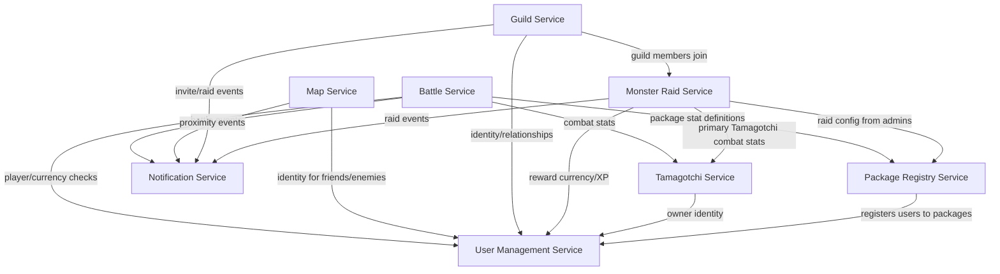

# pad-team-14-tamagotchi-go

Common Public Repository (CPR) for Team 14 — **Topic 2: Tamagotchi Go** (FAF.PAD21.1, Autumn 2026).

A distributed system of 8 microservices letting players raise, battle, and trade virtual pets ("Tamagotchis") across independently developed client apps ("packages") sharing one backend.


## Service Boundaries

### User Management Service
Owns the global identity of players: registration, authentication, profiles, friends/enemies, and both currencies (package-local currency and the shared global currency). Authoritative for identity/relationship/currency questions asked by every other service (e.g. "does this user have enough global currency?").

### Battle Service
Owns turn-based PvP combat execution once a match is created. Calculates damage from Tamagotchi level, type advantage, equipped boosts, and current health; tracks battle state/turn. Distributes rewards (global currency, XP, loser's primary Tamagotchi) at battle end. Does **not** own Tamagotchi or user records — only consults them.

### Tamagotchi Service
Owns the globally relevant state of every Tamagotchi: identity, owner, combat type (one of 6 elemental types with an advantage cycle), level, sprite reference, and package-local health stats (hunger, tiredness, happiness, etc. — intentionally *not* normalized across packages). Secondary Tamagotchis are references to existing entries, never new rows.

### Notification Service
Owns asynchronous delivery to clients via Firebase push notifications. Consumes events published by other services (friend request, nearby player, battle request, guild invite, raid started, etc.) and decides how/whether to deliver them. Does not generate the underlying events itself.

### Map Service
Owns each user's latest known geolocation and proximity detection. Shows nearby users on a map (friends/enemies always visible; unknown users become visible within ~6m). Emits proximity events that *suggest* befriending/battling. Does **not** manage battles or notifications directly — only signals opportunities for them.

### Monster Raid Service
Owns cooperative clicker-style guild raids against a shared monster: current HP, participating users, damage dealt, timestamps, raid status/duration. Distributes rewards on kill or handles raid failure on timeout. Consults Tamagotchi combat stats but doesn't own them.

### Guild Service
Owns guild identity, membership, roles (owner/officer/member), and real-time guild chat over WebSockets. Provides the social context for Monster Raids — members join an active raid with their primary Tamagotchi. Uses User Management Service to resolve identity/relationships for invitations.

### Package Registry Service
Owns the registry of client apps ("packages") participating in the ecosystem: package identifier/version/status, associated moderators/admins, and which users belong to which package. Stores each package's local Tamagotchi stat definitions/thresholds (non-normalized) so Battle Service can compute package-specific bonuses without a shared schema. Admins here design/schedule Monster Raids.

## Technologies & Communication Patterns

The team works in **2 languages**, split by repo/member pair:

| Repo | Service | Language / Framework | Sync communication | Async communication |
|---|---|---|---|---|
| `user-management-service` | User Management | **Go** (e.g. Gin/Echo) | REST CRUD (auth, profile, currency checks) | Publishes friend/relationship/currency-change events for other services to consume |
| `battle-service` | Battle | **Go** (e.g. Gin/Echo) | REST to create/query a match; WebSocket pushes live turn/state updates during a match | Publishes battle-end events (reward/XP/currency change, Tamagotchi transfer) for Notification/Tamagotchi/User Management to consume |
| `tamagotchi-service` | Tamagotchi | **Go** (e.g. Gin/Echo) | REST CRUD (create/level/read stats) | Publishes Tamagotchi-updated/transferred events |
| `notification-service` | Notification | **Go** (e.g. Gin/Echo) | REST for device registration only | Purely event-driven: consumes events from every other service and delivers via Firebase push; no service should call it synchronously for delivery |
| `map-service` | Map | **TypeScript** (Node.js, e.g. NestJS/Express) | REST for nearby-user queries; WebSocket/streaming for continuous geolocation updates | Emits proximity events (async, fire-and-forget) rather than blocking callers |
| `monster-raid-service` | Monster Raid | **TypeScript** (Node.js, e.g. NestJS/Express) | REST for raid queries/attacks (current HP/status) | Publishes raid-complete/raid-failed events for rewards |
| `guild-service` | Guild | **TypeScript** (Node.js, e.g. NestJS/Express) | REST for guild/membership CRUD; WebSocket for Guild Chat (real-time, low-latency) | Publishes invite/raid-join events |
| `package-registry-service` | Package Registry | **TypeScript** (Node.js, e.g. NestJS/Express) | REST for package/moderator/stat-definition CRUD | Publishes raid-config-activated events for Monster Raid Service |

**Why this split:**
- **Go** for User Management, Battle, Tamagotchi, Notification: these are the services with the most structured, relational domain data (accounts, currencies, combat math, stat definitions), and Go's low memory footprint, fast startup, and static typing keep these always-on core services cheap to run while still giving strong compile-time guarantees around combat/currency logic where correctness matters most (e.g. atomic Tamagotchi transfer on battle end). Its built-in goroutine concurrency also handles the event consuming/publishing these services do without extra machinery.
- **TypeScript (Node.js)** for Map, Monster Raid, Guild, Package Registry: these are I/O-heavy, connection-heavy services (constant geolocation streams, guild chat WebSockets, many concurrent raid clicks) where Node's non-blocking event loop and first-class WebSocket support are a natural fit, and where the JSON-shaped, loosely-structured config data (package-specific stat definitions, raid configs) suits a more dynamic language.
- **WebSockets** are used specifically where the interaction is inherently real-time/bidirectional (Battle turn updates, Guild Chat, Monster Raid live damage) — REST elsewhere, since most other operations are simple request/response.
- **Async events** (rather than synchronous calls) are used wherever a service shouldn't block on/depend on the availability of a downstream consumer — most notably Notification Service, and reward/XP distribution after Battle or Monster Raid completes.

## Communication Contract

### Data management strategy

**Database-per-service.** Each of the 8 services owns its own database, matching the ownership boundaries above — no service reaches into another's schema directly. Cross-service data needs are resolved through synchronous REST/WebSocket calls or async events, never shared tables.

| Service | Suggested store | Why |
|---|---|---|
| User Management | PostgreSQL | Relational: accounts, currencies, friend/enemy graph, needs transactional integrity |
| Battle | PostgreSQL (+ in-memory/Redis for live match state) | Match history is relational; active turn state is ephemeral/high-churn |
| Tamagotchi | PostgreSQL | Relational ownership records; package-local stat blobs stored as JSON columns (non-normalized by design) |
| Notification | Redis / lightweight queue store | Ephemeral delivery queue, not long-term source of truth |
| Map | Redis (geospatial) | Frequently-updated key-value/geo lookups, not relational history |
| Monster Raid | PostgreSQL (+ Redis for live HP/damage counters) | Raid definition/results are relational; live damage ticking is high-frequency |
| Guild | PostgreSQL | Relational membership/roles; chat messages can go in the same store or a append-only log |
| Package Registry | PostgreSQL | Relational config data (packages, moderators, stat-definition schemas as JSON) |

All cross-service reads (e.g. Battle Service checking a user's currency) go through that owning service's REST API — never direct DB access.

### Endpoints

Format: `METHOD /path` — request body → response body.

#### User Management Service (`user-battle`, Go)
- `POST /users/register` — `{username, password, email, packageId}` → `{userId, username, email}`
- `POST /users/login` — `{username, password}` → `{token, userId}`
- `GET /users/{userId}` — → `{userId, username, profile, level, xp}`
- `GET /users/{userId}/currency` — → `{localCurrency, globalCurrency}`
- `POST /users/{userId}/currency/adjust` — `{globalCurrencyDelta, localCurrencyDelta, reason}` → `{localCurrency, globalCurrency}`
- `POST /users/{userId}/friends/{targetId}` — → `{status: "pending"|"friends"}`
- `GET /users/{userId}/friends` — → `[{userId, username, status}]`
- `GET /users/{userId}/relationship/{targetId}` — → `{relationship: "friend"|"enemy"|"none"}`

#### Battle Service (`user-battle`, Go)
- `POST /battles` — `{player1Id, player2Id, primaryTamagotchiId, secondaryTamagotchiId, boosts[]}` → `{battleId, status: "in_progress"}`
- `GET /battles/{battleId}` — → `{battleId, state, currentTurn, healthP1, healthP2}`
- `POST /battles/{battleId}/action` — `{userId, action, targetMoveId}` → `{battleId, state, log[]}`
- `WS /battles/{battleId}/live` — server pushes `{type: "turn_update"|"battle_end", payload}`
- On battle end (internal event, not client-facing): publishes `BattleEnded {winnerId, loserId, rewardCurrency, rewardXp, transferredTamagotchiId}`

#### Tamagotchi Service (`tamagotchi-notification`, Go)
- `POST /tamagotchis` — `{ownerId, type, packageId, name}` → `{tamagotchiId, type, level, stats}`
- `GET /tamagotchis/{id}` — → `{tamagotchiId, ownerId, type, level, sprite, packageStats}`
- `GET /users/{userId}/tamagotchis` — → `[{tamagotchiId, type, level, isPrimary}]`
- `PATCH /tamagotchis/{id}/stats` — `{statUpdates: {...}}` → `{tamagotchiId, packageStats}`
- `POST /tamagotchis/{id}/xp` — `{xpAmount}` → `{tamagotchiId, level, xp}`
- `POST /tamagotchis/{id}/transfer-owner` — `{newOwnerId}` → `{tamagotchiId, ownerId}`

#### Notification Service (`tamagotchi-notification`, Go)
- `POST /notifications/register-device` — `{userId, fcmToken}` → `{status: "registered"}`
- `GET /notifications/{userId}` — → `[{id, type, payload, read, createdAt}]`
- (No public "send" endpoint — triggered internally by consuming events: `FriendRequestReceived`, `NearbyPlayerDetected`, `BattleRequestReceived`, `TamagotchiCaptured`, `GuildInvitation`, `RaidStarted`)

#### Map Service (`map-raid`, TypeScript)
- `POST /map/location` — `{userId, lat, lng, timestamp}` → `{status: "updated"}`
- `GET /map/nearby/{userId}` — → `[{userId, distance, relationship}]`
- `WS /map/stream/{userId}` — client streams `{lat, lng, timestamp}` continuously
- Publishes `ProximityDetected {userAId, userBId, distance}` when two unrelated users cross the threshold

#### Monster Raid Service (`map-raid`, TypeScript)
- `POST /raids/{raidId}/join` — `{userId, tamagotchiId}` → `{raidId, participantCount}`
- `POST /raids/{raidId}/attack` — `{userId}` → `{raidId, monsterHp, damageDealt}`
- `GET /raids/{raidId}` — → `{raidId, monsterHp, maxHp, participants[], status, expiresAt}`
- Publishes `RaidCompleted {raidId, rewards: [{userId, currency, xp}]}` or `RaidFailed {raidId}`

#### Guild Service (`guild-registry`, TypeScript)
- `POST /guilds` — `{name, ownerId}` → `{guildId, name}`
- `POST /guilds/{guildId}/members` — `{userId, invitedBy}` → `{status: "invited"|"joined"}`
- `GET /guilds/{guildId}` — → `{guildId, name, members: [{userId, role}]}`
- `PATCH /guilds/{guildId}/members/{userId}/role` — `{role}` → `{userId, role}`
- `WS /guilds/{guildId}/chat` — bidirectional `{authorId, message, timestamp}`

#### Package Registry Service (`guild-registry`, TypeScript)
- `POST /packages` — `{name, version, description, moderatorIds[]}` → `{packageId, status}`
- `GET /packages/{packageId}` — → `{packageId, name, version, status, statDefinitions}`
- `PUT /packages/{packageId}/stat-definitions` — `{statDefinitions: {...}}` → `{packageId, statDefinitions}`
- `POST /packages/{packageId}/users` — `{userId}` → `{status: "registered"}`
- `POST /raid-configs` — `{monsterName, maxHp, duration, rewards, createdByAdminId}` → `{raidConfigId}`
- `POST /raid-configs/{id}/activate` — → `{raidId, status: "active"}`

## Architecture Diagram



## Getting Started

Clone the CPR together with all submodules:

```bash
git clone --recurse-submodules https://github.com/IsStephy/pad-team-14-tamagotchi-go.git
cd pad-team-14-tamagotchi-go
```

If you already cloned without `--recurse-submodules`, pull the submodule content separately:

```bash
git submodule update --init --recursive
```

Pull in the latest changes for every submodule later on:

```bash
git submodule update --remote --merge
```

Each submodule is an independent service repo — enter it and follow its own README for language-specific setup/run instructions:

```bash
cd user-battle              # or tamagotchi-notification / map-raid / guild-registry
```

